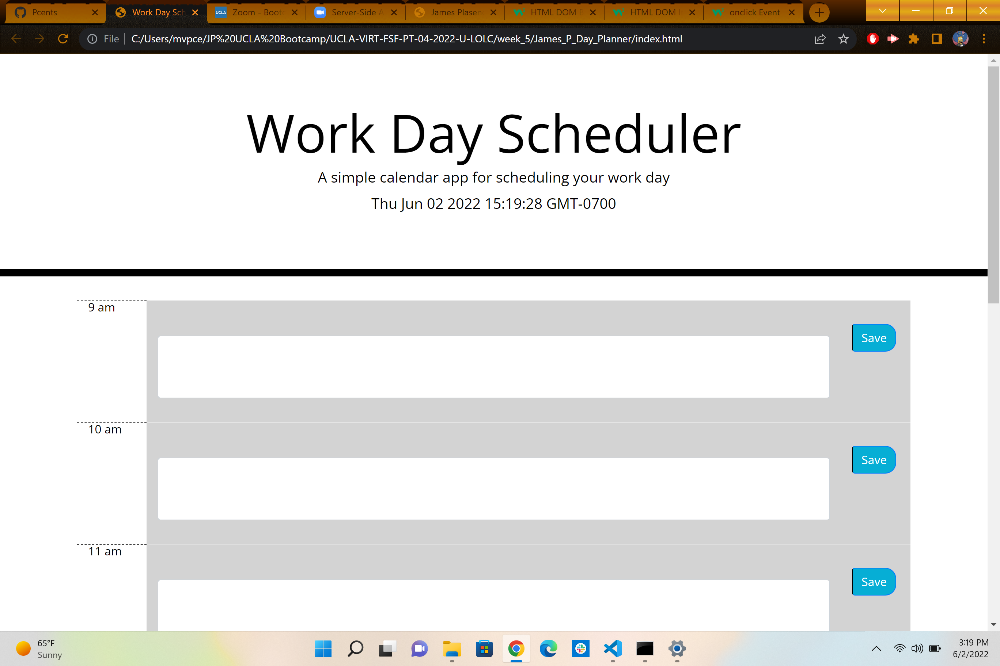
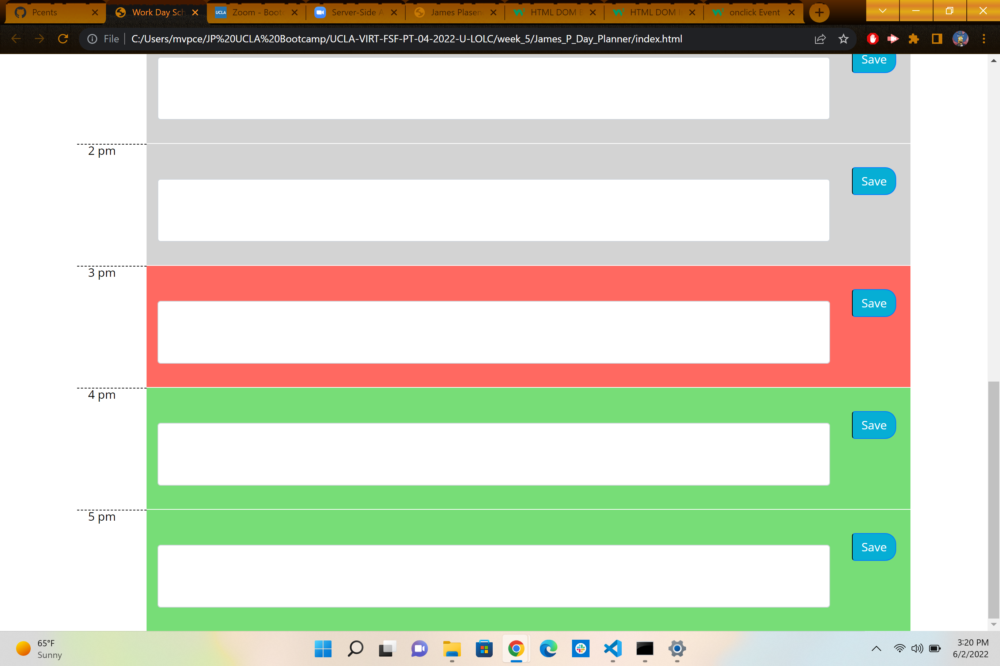

# James_P_Day_Planner
I have created a day planner that is able to change the hour colors based on the time and is able to store the text inputed into local storage.  I was not able to keep the text in the tab upon refresh.
Link to the live website
https://pcents.github.io/James_P_Day_Planner/

